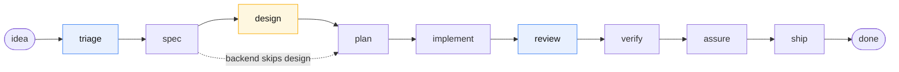
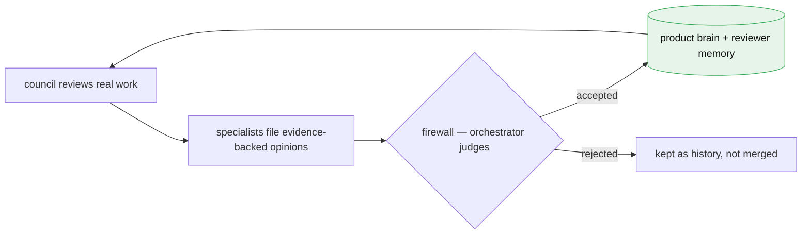

# Factory

> **From idea to shipped — on an assembly line of AI specialists, inside [Claude Code](https://claude.com/claude-code).**

You give Factory a feature idea (or a whole PRD, or an existing codebase). It carries that idea all the way to merged, tested code — triage, spec, design, build, review, ship — with a team of AI specialists doing the work and a review *council* that checks the work — and learns your taste as it goes. It stops for you where judgment lives: **which design direction do you want** — and, when it can't honestly assure a customer journey, it parks and asks rather than guessing. Everything else runs on its own.

Runs on any Claude model.

## The idea in one minute

Shipping a feature is never one step. It's a dozen: write a spec, pick a design, plan the work, write the code, review it, test it, merge it — and keep all of it moving.

Factory is an **assembly line** for exactly that. You drop an idea onto the line; it moves from station to station, and a specialist handles each one. Four rules make it trustworthy:

- **Nothing advances until it passes.** Every station has real checks — a spec must exist, a plan must list tasks, tests must be green — and before anything ships, a fresh-context reviewer walks the affected customer journey against the running product (screenshots, console, network — not vibes). An item can't skip ahead.
- **A council reviews the work — not a lone bot.** At two points (triage and code review), a panel of AI personas argues it out *with evidence*.
- **The council learns your taste.** Evidence-backed findings pass a firewall into the product's durable memory, so the council gets sharper on *your* conventions and standards with every review — never generic, never a silent edit. *([more below](#it-learns-your-taste))*
- **You're interrupted only where judgment matters.** The one built-in human stop is **design**: Factory produces a few real mockups and waits for you to choose. The rest is autonomous.

## How it works



- 🔵 **Blue = the council.** At **triage** ("build it? at what priority?") and **review** ("does the code actually match the spec?"), six specialist seats — product, architecture, engineering, UI, customer, commercial — weigh in before the item moves on.
- 🟡 **Amber = you.** **Design** is the single station that pauses for a human. Factory writes 2–4 genuinely different mockup options and waits for your pick. *(Backend-only items skip design — there's nothing to render.)*

In one line: `idea → triage → spec → design → plan → implement → review → verify → assure → ship → done`.

## See it run (60 seconds)

```text
/factory:add "Dark mode"
   → files work item 0001-dark-mode. Nothing runs yet.

/factory:run
   → triage → spec → design … then pauses:
     "Design options ready: docs/factory/packets/0001-dark-mode-design.md
      Pick one:  factory choice 0001-dark-mode <a-d>"

factory choice 0001-dark-mode b          ← you skim the mockups and choose B

/factory:run
   → plan → implement → review → verify → assure → ship → done ✅
```

That's the whole loop: **add → run → pick a design → run → shipped.** The only thing you did by hand was choose the look.

## It learns your taste

Most AI reviewers start from a blank slate every time. Factory's council doesn't — it keeps a memory of *your* product, and that memory compounds with every review.

Whenever the council reviews real work, each specialist files **evidence-backed opinions**: a constraint it confirmed, a pattern your codebase prefers, a market read. None of it lands in memory on trust. Each claim passes a **firewall** — the orchestrator judges it (accept / reject / defer …), and *only* an accepted, evidence-cited claim may update the product's "brain." No specialist edits that memory directly, and every change is logged with the judgement that authorized it. The memory sharpens; it never silently drifts.

Two things compound over time:

- **Each reviewer carries its own notes forward.** Next round, the UI seat already knows your design conventions and the architecture seat already knows your constraints — they judge against *your* standards, not generic ones.
- **Being right earns attention.** Every judgement nudges a per-topic reputation score, so voices that have been right get read and weighed first next time. A low score never silences a claim, though — reputation ranks attention, it doesn't censor.

You can seed this on day one — point Factory at an existing codebase and it mines your conventions, or answer a short "taste" questionnaire (products you admire, your non-negotiables, what "done" means to you). And because you're sitting at `/factory:init`, it closes with a short interview: whatever intake and research couldn't answer from a real source, asked one question at a time — every one skippable, "park the rest" stops it, and each answer lands in the brain as a cited claim. (Unattended runs never interview; skipped questions just stay filed.) But the real sharpening happens on your own diffs, review after review.



## What makes it different

- **Autonomous where it can be, human where it should be.** One default stop (design) — and you can dial that up or down.
- **Evidence, not vibes.** Every stage transition is gate-checked by a deterministic engine; "done" requires proof — a spec on disk, a plan with tasks, green tests.
- **"Done" means a customer got through it.** Between verify and ship, a fresh-context journey reviewer — no memory of the implementation — walks the affected journeys against the running product and files evidence the engine validates. What it can't run parks for you; what you still find becomes an escape that stays open until it's promoted into a permanent check.
- **Effort scales to how much the work matters.** Every item is a *bug*, a *feature*, or an *epic*, and Factory sizes the process to match — a bug gets a fast, correctness-only review; a material epic gets the full council and a market focus group. No epic-weight ceremony for a one-line fix.
- **Portable.** Works on any Claude model; faster-model features are bonuses, never requirements.

## Three ways to start

| You have… | Run this |
|---|---|
| **One idea** | `/factory:add "Dark mode"` → `/factory:run` |
| **A whole PRD** | `/factory:roadmap prd.md` — turns it into a triaged, prioritized backlog |
| **An existing codebase** | `/factory:init` mines your repo — routes, tests, conventions, git history — to seed Factory's understanding before it touches anything, then interviews you on whatever it couldn't find out |

## Install

Factory is a Claude Code plugin:

```
/plugin marketplace add https://github.com/jzjq567/Factory
/plugin install factory
```

**You also need the Superpowers plugin.** Factory leans on its skills (test-driven development, systematic debugging, verification) for execution discipline instead of re-implementing them, so install it alongside Factory. *(Plugin manifests can't declare dependencies yet — so this one's on you.)*

For local hacking, point Claude Code at a checkout directly instead:

```bash
claude --plugin-dir /path/to/Factory
```

## Quickstart

In the repo you want Factory to work on:

```
/factory:init your-product   # scaffold state + seed the product "brain" from real sources, then interview you on the gaps
/factory:add "Dark mode"     # add a work item
/factory:bug "Save button crashes on empty title"   # report a bug — replicated before any fix, proven fixed before merge
/factory:run                 # run the pipeline — one item, stage by stage
/factory:status              # what's in flight, what's waiting on you, memory health
/factory:autopilot           # drain the whole backlog unattended (still won't answer your gates)
```

Full walkthrough — the design gate, the autonomy dial, where state lives — in **[docs/getting-started.md](docs/getting-started.md)**.

## Under the hood

- A **deterministic, zero-dependency engine** (Python) owns all state and the gate checks. The AI skills drive it but can't bypass a gate. State splits into `.factory/` (machine-owned: work items, council ledgers) and `docs/factory/` (human-readable: the brain, the roadmap, review packets awaiting a decision).
- **Optional parallel execution.** Turn on *headless workers* and Factory builds independent items concurrently — each in its own isolated git worktree, driven by a headless `claude` or `codex` process — while the orchestrator only collects the results and advances them through the same gates. Off by default; absent, it degrades to in-process building. Both this and the materiality *tiers* are config knobs in `.factory/config.json`.
- **Full design spec:** [docs/superpowers/specs/2026-07-03-software-factory-design.md](docs/superpowers/specs/2026-07-03-software-factory-design.md)
- **Tests:** `python3 -m unittest discover -s tests -v` (505+, all green)

## Status

Working and tested, actively evolving — a real pipeline, a real council, real gates. Early but functional; expect sharp edges as it matures.
